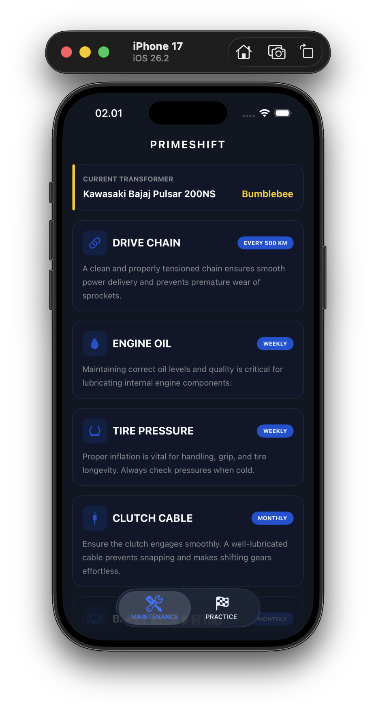
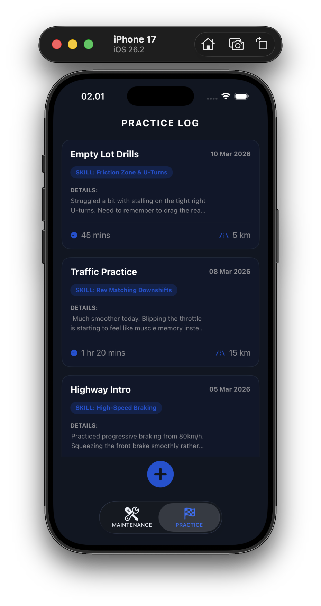
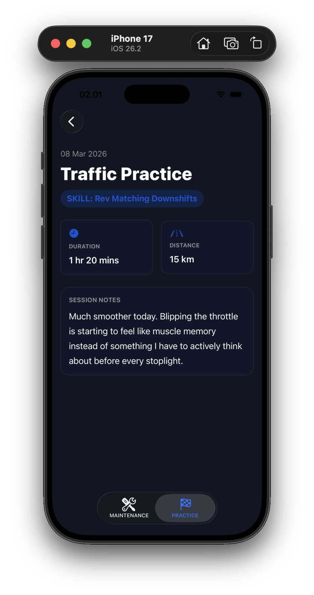

<!-- prettier-ignore -->
<div align="center">

# PrimeShift

[](https://developer.apple.com/swift/)
[](https://developer.apple.com/xcode/swiftui/)
[](https://www.sketch.com/)

[The Story](#the-story) • [The Design Funnel](#the-design-funnel) • [Screenshots](#screenshots) • [Getting Started](#getting-started)

</div>

## The Story

I'm a backend developer. Until recently, the closest I'd come to design was dragging a button onto a WinForms form. 

Then Challenge Zero at Apple Developer Academy Bali asked me to pick up a pen. Not open Xcode. A pen. And sketch an app idea on paper.

### The Idea
I'd been wanting to buy a manual motorcycle, a Kawasaki Bajaj Pulsar 200NS. But I knew nothing about them. Not how to ride one, not how to maintain one, not even the names of the components. 

So that became the idea: **PrimeShift**, a maintenance tracker and riding practice logger built specifically for someone starting from zero.

## The Design Funnel

The challenge ran like a design funnel, forcing me to design and sketch before coding—something I never used to do.

1. **Pen and paper sketches**: Rough, ugly, and surprisingly useful.
2. **Hi-Fi Mockup (Sketch)**: This part was genuinely hard. Manipulating components, getting spacing right, thinking about visual hierarchy without any design vocabulary.
3. **SwiftUI Implementation**: The mentors broke down the UI into SwiftUI building blocks: `VStack`s, `HStack`s, `LazyVStack`s, and how `NavigationStack` works. And I built it.

> [!IMPORTANT]
> **Key Takeaway**
> The whole process forced me to design and sketch before coding. It helped me see how everything fits together, not just the code.

## Screenshots

Exactly as simple as it needed to be. Mock data, and just 2 screens.

| | | |
|---|---|---|
|  |  |  |

## Getting Started

To explore this challenge locally:

1. Open `PrimeShift.xcodeproj` in Xcode.
2. Choose a simulator (e.g., iPhone 15).
3. Press **⌘R** to build and run.

## Project Structure

```text
AppleAcademy-Ch0-PrimeShift/
├── README.md
├── ReadmeAssets/                  # Project screenshots
├── PrimeShift.xcodeproj/          # Xcode project file
└── PrimeShift/
    ├── PrimeShiftApp.swift        # App entry point
    ├── ContentView.swift          # Main UI view
    └── Assets.xcassets/           # App icons and images
```
