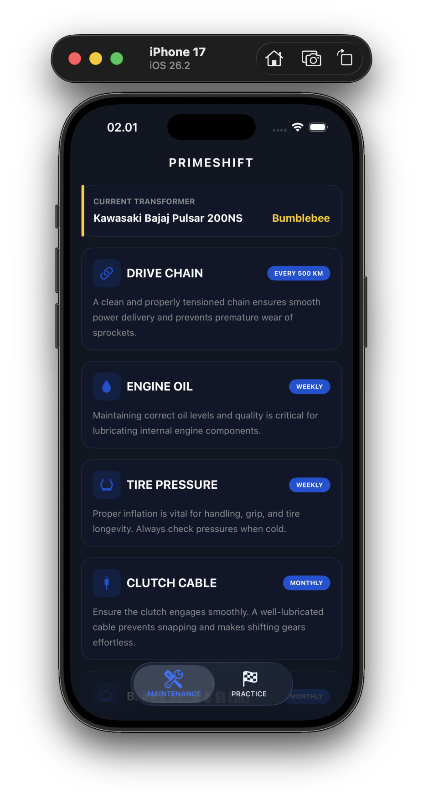
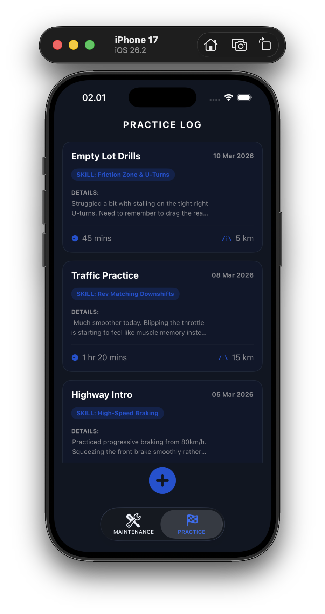
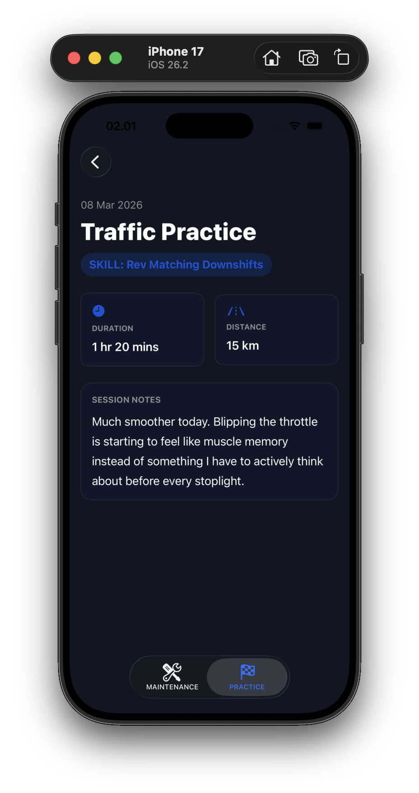

<div align="center">

# PrimeShift

[](https://developer.apple.com/swift/)
[](https://developer.apple.com/xcode/swiftui/)

[Overview](#overview) • [Features](#features) • [Getting started](#getting-started) • [Project Structure](#project-structure)

</div>

## Overview

PrimeShift is my starter individual SwiftUI project for Challenge 0 at the Apple Developer Academy. I built it to practice the basics of Xcode and SwiftUI layout, specifically focusing on creating lists and navigation stacks.

This app is designed to help me maintain my manual motorcycle maintenance checkups for each part, and to log my learning journey of how to ride a manual motorcycle.

> [!NOTE]
> This was my very first app, and currently has a single screen demonstrating fundamental layout concepts.

## Features

- **Navigation**: Uses a `NavigationStack` with the title **Academy Eats**
- **Lists**: Displays a single-row `List` structure
- **UI Composition**: Employs an `HStack` row combining a local asset image (`biker`) and a text label (**An OG Biker**)

## Getting started

To explore this challenge locally:

1. Open `PrimeShift.xcodeproj` in Xcode.
2. Choose a simulator (e.g., iPhone 15).
3. Press **⌘R** to build and run.

## Project Structure

```text
AppleAcademy-Ch0-PrimeShift/
├── README.md
├── PrimeShift.xcodeproj/
└── PrimeShift/
    ├── PrimeShiftApp.swift
    ├── ContentView.swift
    └── Assets.xcassets/
```

## Screenshots

| | | |
|---|---|---|
|  |  |  |
