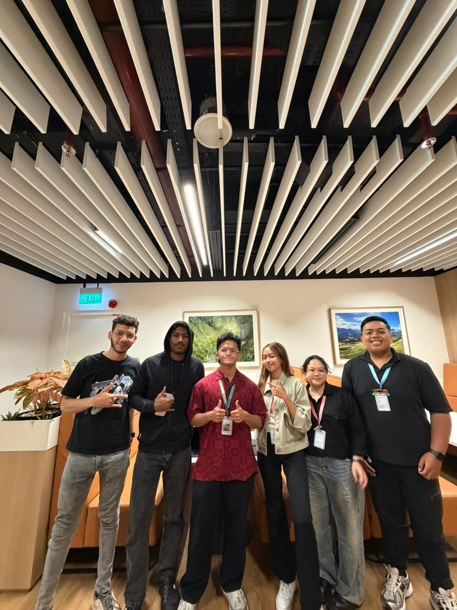
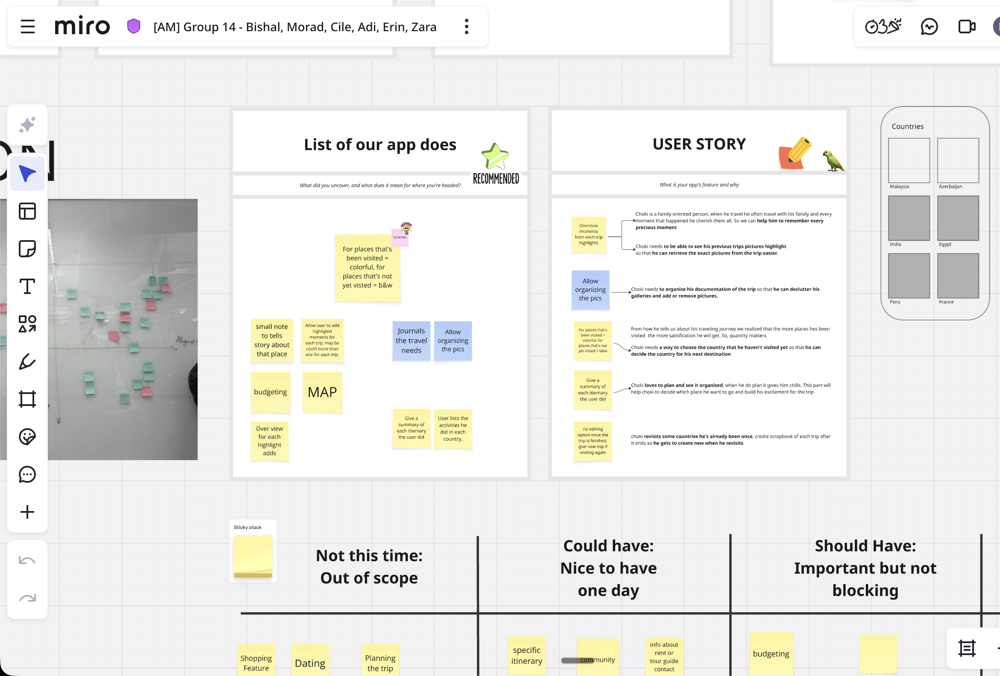
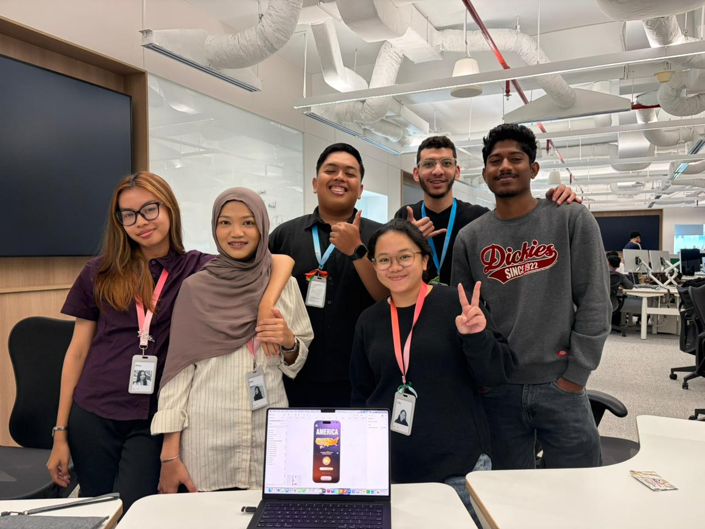

<!-- prettier-ignore -->
<div align="center">


# Help an Academy Friend

[](https://www.sketch.com/)
[](#)

[The Story](#the-story) • [The Challenge & Learnings](#the-challenge--learnings) • [Final Prototype](#final-prototype) • [Getting Started](#getting-started) • [Project Structure](#project-structure)

</div>

## The Story

We didn't start with a design tool for Challenge 1 at Apple Developer Academy Bali. We started with a person: Cho, one of our Academy friends. Our job wasn't to build something cool. It was to understand him well enough to build something useful. Big difference.

### Empathize and Ideate

Through profile reviews and two interviews designed to uncover rather than confirm, we learned that Cho loves traveling. He collects memories from the places he visits, but had no good way to organize or revisit them.



So our team of 6 designed a travel memory app just for him. The app allows storing memories by country, browsing a personalized itinerary view of each trip, and getting a summary of anywhere you've been. Built around how Cho actually thinks about travel, not how we assumed he did.



## The Challenge & Learnings

We went from lo-fi to hi-fi, and the hi-fi stage is where we ran into real friction.

Everyone built their own version individually before we'd agreed on anything. No shared design language. Some went with Apple's new Liquid Glass aesthetic, while others built fully custom systems in Figma. When we brought them together, we had 6 different visual worlds to reconcile into 1 coherent product.

> [!IMPORTANT]  
> **Key Takeaways**
> - Agree on the design system before you split the work, not after.
> - Great products start with understanding people, and great teams start with alignment.



## Final Prototype

https://github.com/user-attachments/assets/41e87a7c-ab40-4fce-a5ec-52dad7039f32

## Getting Started

To view the deliverables for this challenge:

1. Install **Sketch** from [sketch.com](https://www.sketch.com/) or the Mac App Store.
2. Open `My individual Design.sketch`.
3. Browse the artboards in the left-hand layers panel.

## Project Structure

```text
AppleAcademy-Ch01-HelpAnAcademyFriend/
├── ReadmeAssets/
│   ├── Ch01-Team-Final-HIFI.mp4   # Final design screen recording
│   ├── MiroDocumentation.png      # Miro board documentation
│   ├── Team-Interview-Pic.jpeg    # Interviewing our friend Cho
│   ├── TeamProgressPic.jpeg       # Team working on the design
│   └── ch01-team-hifi-preview.svg # Video preview thumbnail
└── My individual Design.sketch    # Sketch design file with artboards and UI components
```

> [!NOTE]
> The Sketch file acts as a visual design reference that a developer could use to implement the UI in SwiftUI.
