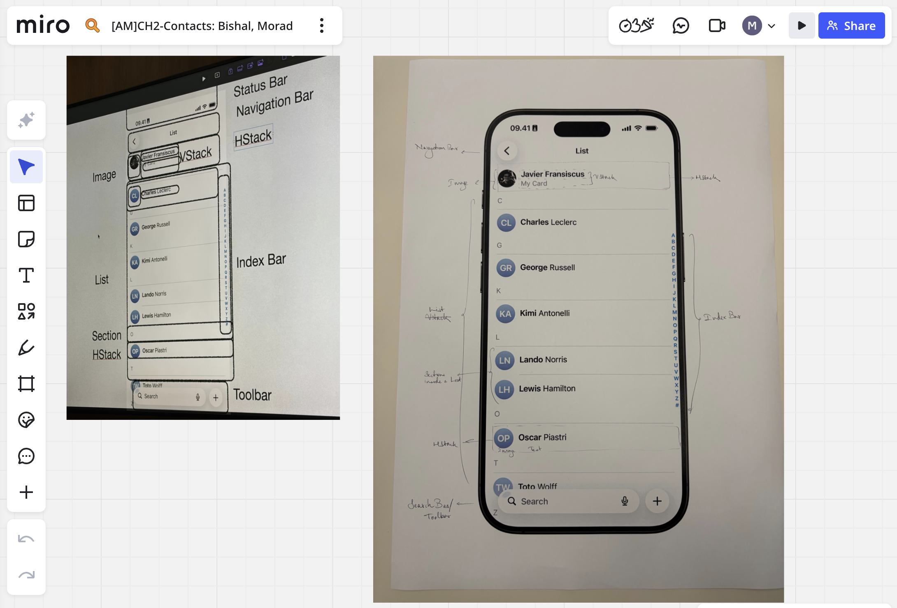
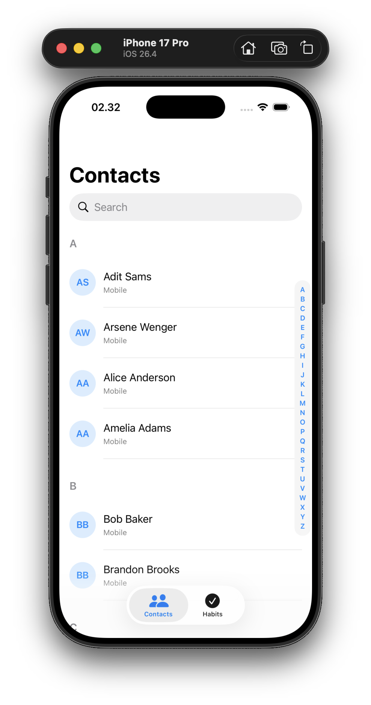
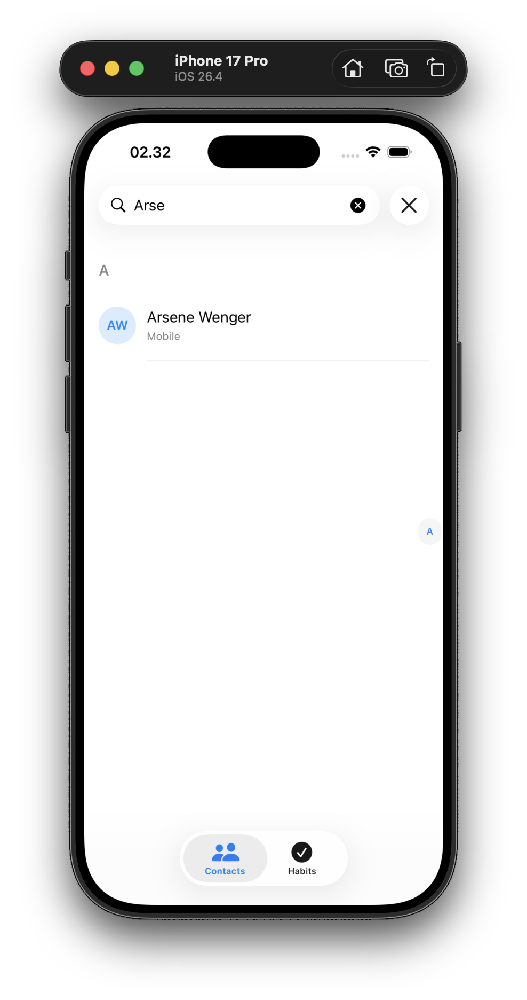
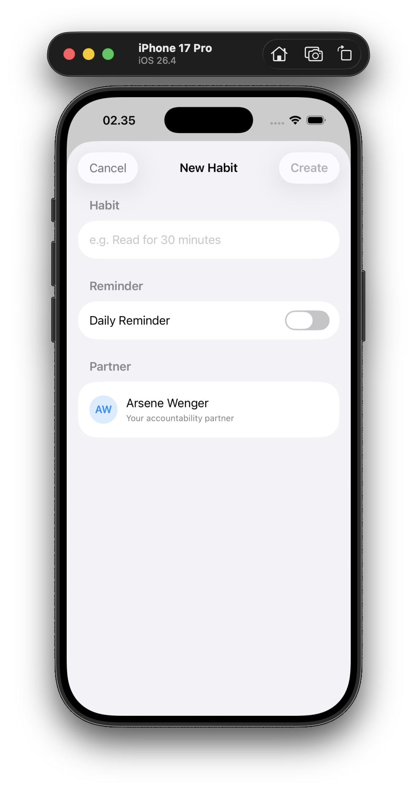
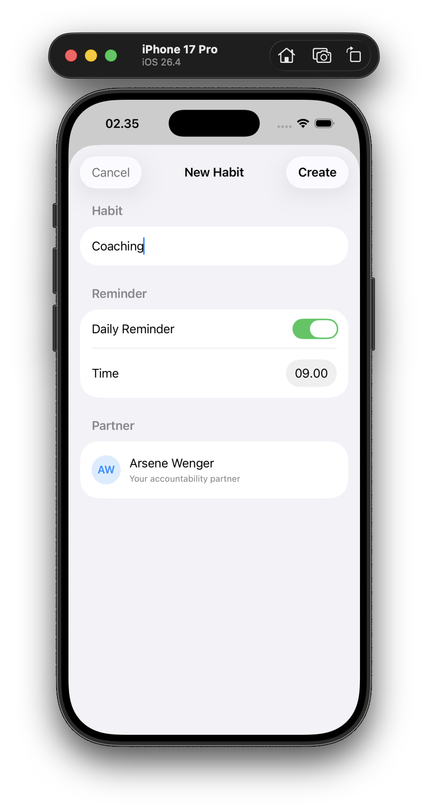
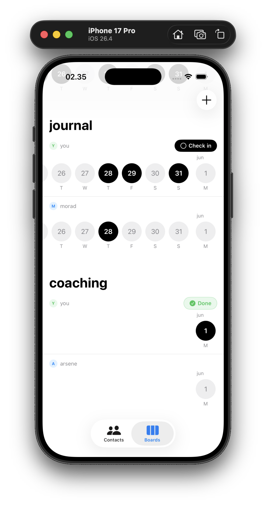

<div align="center">

# Contacts App Remix 👥

[](https://developer.apple.com/swift/)
[](https://developer.apple.com/xcode/swiftui/)

[The Challenge](#the-challenge) • [The Remix](#the-remix-accountability-habits) • [Technical Breakdown](#technical-breakdown) • [Getting Started](#getting-started) • [Screenshots](#screenshots)

</div>

## The Challenge
As part of our journey to learn Swift, we were challenged to partner up in duos, pick a native Apple app, and "remix" it into something completely new. We chose the **Contacts** app as our foundation, aiming to transform a static list of names into a dynamic tool for personal growth.

## The Remix: Accountability Habits
Our vision for the remix was rooted in **accountability**. We asked ourselves: *What if the people in your contacts weren't just phone numbers, but accountability partners?* 

We reimagined the Contacts app as a space to create, share, and track habits with your friends and family. By linking your goals with the people you already know, the app leverages your real-life social circle to keep you consistent. 

<div align="center">
  
</div>

## Technical Breakdown

From a technical perspective, this challenge was designed to teach us a crucial lesson in software architecture: **start simple, then generalize**. The project was built in two distinct stages:

1. **Static (`AcademyVersion.swift`)**: We started by hardcoding the contacts and sections. This was fast to write and helped us get a feel for the UI, but it was impossible to scale.
2. **Dynamic (`DictionaryViewVersion.swift`)**: We then evolved the codebase to use data-driven grouping via Swift's `Dictionary(grouping:)` method. This made the list completely scalable and reusable.

> [!TIP]
> The dynamic version demonstrates how adding a new contact is as simple as adding a string to an array, and the UI automatically manages the sorting and sectioning.

### Key Features
- **List with Sections**: Building alphabetically sectioned lists.
- **Section Index**: Incorporating a side scrubber using `.listSectionIndexVisibility(.visible)`.
- **Native Search Bar**: Added via the `.searchable()` modifier.
- **Dynamic Grouping**: Grouping an array into a keyed dictionary in one line with `Dictionary(grouping:)`.

## Getting started

To run the project locally:

1. Open `Contacts.xcodeproj` in **Xcode 15+**.
2. Select any iPhone simulator (e.g., *iPhone 16*).
3. Press **⌘ R** — the app will launch with `StaticContactsView`.
4. To preview the dynamic version, open `DictionaryViewVersion.swift` and use the **#Preview** canvas.

## Project Structure

```text
AppleAcademy-Ch02-ContactsAppRemix/
├── Contacts.xcodeproj/
├── ReadmeAssets/              # App screenshots & assets
│   ├── AppBreakDown-Miro.png
│   ├── Ch02-ContactAppRemix-01.png
│   ├── Ch02-ContactAppRemix-02.png
│   ├── Ch02-ContactAppRemix-03.png
│   ├── Ch02-ContactAppRemix-04.png
│   └── Ch02-ContactAppRemix-05.png
└── Contacts/
    ├── MainApp.swift              # Entry point → shows StaticContactsView
    ├── AcademyVersion.swift       # Static implementation
    ├── DictionaryViewVersion.swift# Dynamic implementation
    └── Assets.xcassets/
```

## Screenshots

<table>
    <tr>
        <td></td>
        <td></td>
        <td></td>
    </tr>
    <tr>
        <td></td>
        <td></td>
        <td></td>
    </tr>
</table>
