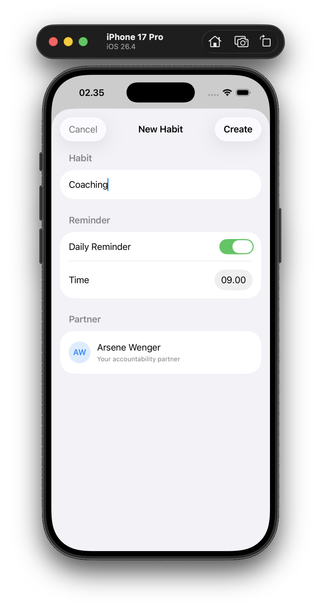

<div align="center">

# Contacts App Remix

[](https://developer.apple.com/swift/)
[](https://developer.apple.com/xcode/swiftui/)

[Overview](#overview) • [Features](#features) • [Getting started](#getting-started) • [Project Structure](#project-structure)

</div>

## Overview

The **Contacts** challenge reproduces the look and feel of iOS's native Contacts app using SwiftUI. It was built in two distinct stages to teach a crucial lesson: **start simple, then generalize**.

1. **Static (`AcademyVersion.swift`)**: Hardcoded contacts and hardcoded sections — fast to write, but impossible to scale.
2. **Dynamic (`DictionaryViewVersion.swift`)**: Data-driven grouping via Swift's `Dictionary(grouping:)` — scalable and reusable.

> [!TIP]
> The dynamic version demonstrates how adding a new contact is as simple as adding a string to an array, automatically managing sections and sorting.

## Features

- **List with Sections**: Building alphabetically sectioned lists.
- **Section Index**: Incorporating a side scrubber using `.listSectionIndexVisibility(.visible)`.
- **Native Search Bar**: Added via the `.searchable()` modifier.
- **Dynamic Grouping**: Grouping an array into a keyed dictionary in one line with `Dictionary(grouping:)`.

## Getting started

To run the project locally:

1. Open `Contacts.xcodeproj` in **Xcode 15+**.
2. Select any iPhone simulator (e.g. *iPhone 16*).
3. Press **⌘ R** — the app launches with `StaticContactsView`.
4. To preview the dynamic version, open `DictionaryViewVersion.swift` and use the **#Preview** canvas.

## Project Structure

```
AppleAcademy-Ch2-Contacts/
├── Contacts.xcodeproj/
└── Contacts/
    ├── MainApp.swift              # Entry point → shows StaticContactsView
    ├── AcademyVersion.swift       # Static implementation
    ├── DictionaryViewVersion.swift# Dynamic implementation
    └── Assets.xcassets/
```

## Screenshots

<table>
    <tr>
        <td></td>
        <td></td>
        <td></td>
    </tr>
    <tr>
        <td></td>
        <td></td>
        <td></td>
    </tr>
</table>
