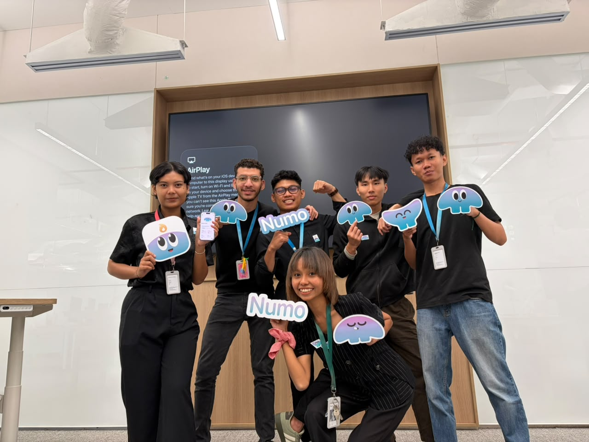
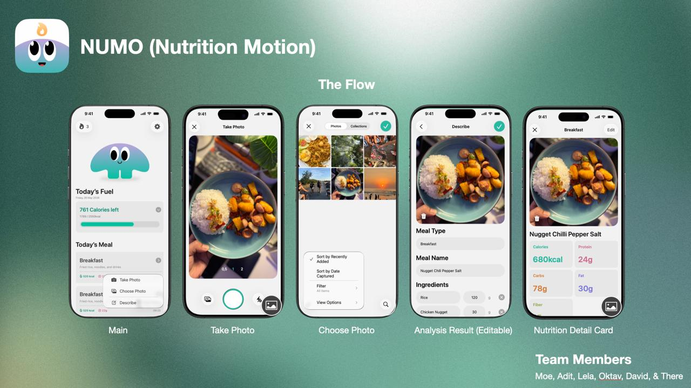

<div align="center">

# Numo - Gym Nutrition Tracker 🥗💪

[](https://developer.apple.com/swift/)
[](https://developer.apple.com/xcode/swiftui/)
[](https://developer.apple.com/xcode/swiftdata/)

[Overview](#overview) • [The Story Behind Numo](#the-story-behind-numo) • [Features](#features) • [Getting started](#getting-started) • [Project Structure](#project-structure)

</div>

<div align="center">
  
</div>

## Overview

Numo is an iOS application designed to help gym-goers and fitness enthusiasts track their daily nutrition and maintain a healthy lifestyle. This project emphasizes a clean separation of concerns and robust UI development using a modular SwiftUI architecture.

> [!NOTE]
> This app heavily relies on SwiftData for persistence, ensuring all your daily meals and profile data are stored securely on-device.

<div align="center">
  
</div>

## The Story Behind Numo

Our team of 6 (2 designers, 3 developers, and 1 PM) was given three anchors to choose from: Utilities, Health, and Travel. We unanimously decided to pivot into the **Health** domain.

We set out to explore how to help gym-goers remain consistent with their goals. Through extensive user interviews and desk research, a strong insight emerged: **Nutrition is a critical part of fitness, yet it is widely ignored.** The biggest friction point? Keeping track of nutritional intake is tedious and difficult—especially when dealing with unknown ingredients or eating ordered meals. 

To solve this, we created **Numo**. Instead of just tedious manual logging, Numo allows you to simplify your tracking experience (including photo capture functionality) so you can seamlessly track food even when you don't know the exact macros.

## Features

- **Smart Meal Logging**: Quickly log daily meals either manually or seamlessly to overcome the hurdle of unknown food.
- **Nutrition Tracking**: Keep an eye on calories and macronutrients throughout your day.
- **Personalized Goals**: Set and monitor fitness and diet goals.
- **Progress Insights**: Visualize nutrition habits over time with beautiful charts, a dashboard, and meal history summaries.
- **SwiftData Persistence**: Offline-first, fast database interactions to keep all your data on your device.

## Getting started

To run the project locally:

1. Open `Numo.xcodeproj` in **Xcode 15+**.
2. Select your preferred iPhone simulator.
3. Press **⌘ R** to build and run the app.

> [!IMPORTANT]
> If you experience a crash in Xcode previews, ensure that your preview uses the in-memory `ModelContainer` configured in the project.

## Project Structure

```text
AppleAcademy-Ch03-Nutrition/
├── README.md
├── ReadmeAssets/              # Screenshots and project assets
│   ├── Ch03-AppFlow.jpg
│   ├── Ch03-MealEntry.jpg
│   └── Ch03-TheEnd.jpg
├── Config/
├── Numo.xcodeproj/
└── Numo/
    ├── App/
    ├── Core/
    ├── DesignSystem/
    ├── Features/
    └── Resources/             # App configuration files (plist, template)
```
