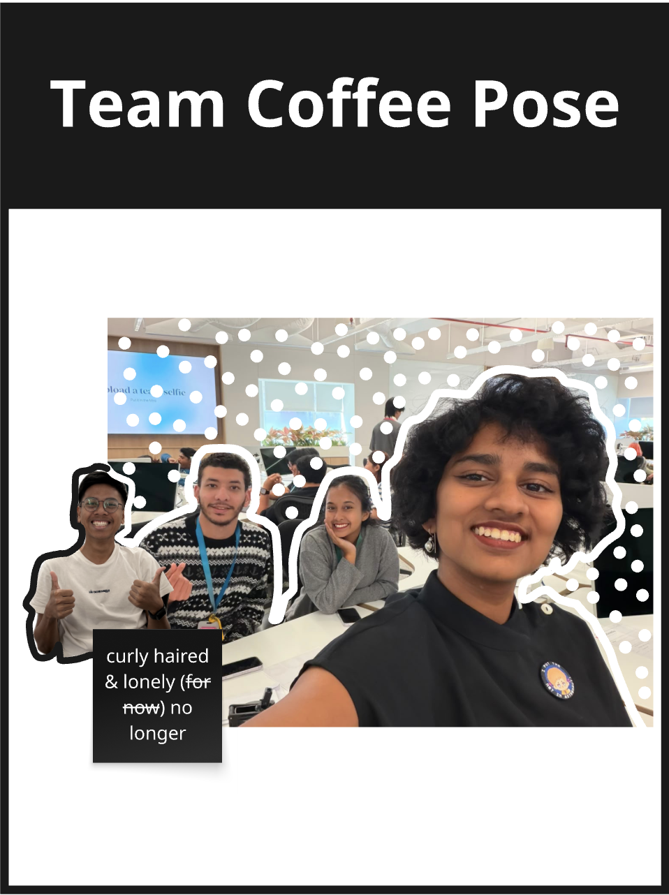
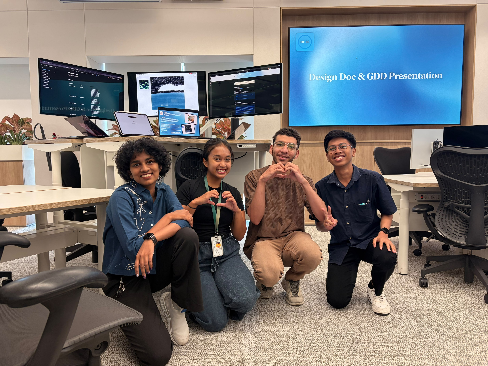
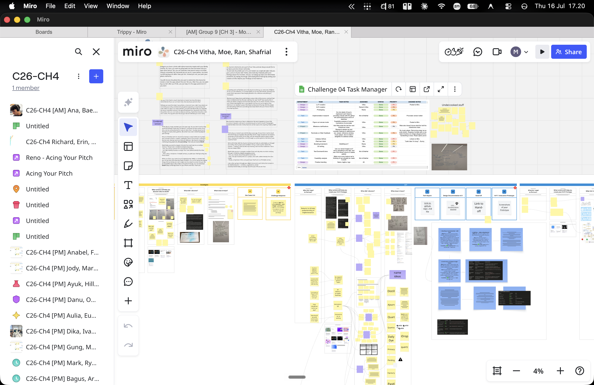
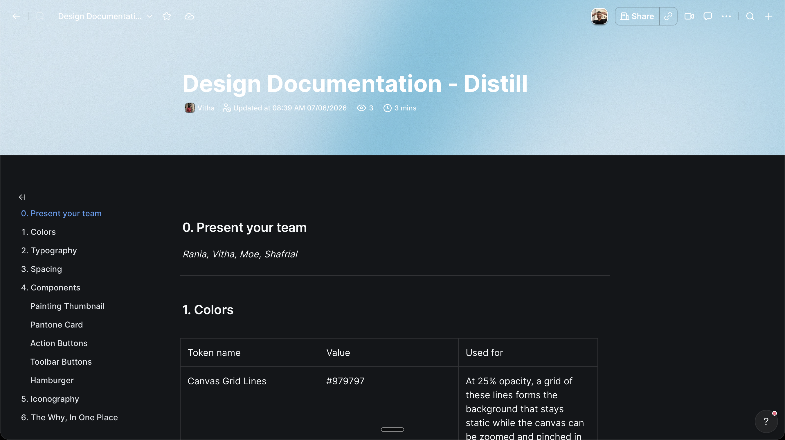

# Distill - iPadOS Painting & Multimedia 🎨

[The Story](#the-story-behind-distill) • [The Team](#meet-the-team) • [Design & Process](#design--documentation) • [Exploration Log](#the-exploration-log) • [Getting Started](#getting-started)

## The Story Behind Distill

For this challenge, we wanted to break out of our comfort zone. Instead of sticking strictly to standard iOS development, we found ourselves roaming and exploring other possibilities within the Apple ecosystem. We wanted to see what else we could build for, which led us straight to **iPadOS** and the fascinating world of multimedia. 

Distill was born out of this curiosity—an application built around rich media experiences and drawing capabilities using **CoreGraphics** and **PencilKit**, combined with **AVFoundation**.

  

## Meet the Team

Our incredible team behind this exploration: **Rania, Na Vitha, Shafrial Azis, and Mohamed Morad (Moe)**.

  
  

  

## Design & Documentation

We documented everything meticulously. Before writing code, we spent a lot of time mapping out our ideas, flows, and architectures to ensure we fully grasped the frameworks we were about to tackle.

  

 

  

## The Exploration Log

This section serves as our technical reflection throughout the journey. It bridges the gap between what we originally thought we'd build and what we actually learned in the trenches.

  

### Our Starting Assumptions
Before we even opened Xcode, we assumed we'd be working heavily with pure media—videos, audio, and tinkering with playback. It sounded straightforward because we explicitly chose the multimedia framework. We thought it would just be about putting a video on a screen and pressing play.

### What We Actually Built & Discovered
We started by implementing `AVPlayer` to see how media playback works under the hood. 

**The reality check:** We quickly discovered that playing media is far from simple! There are so many complex layers inside `AVFoundation`. It's not just a "play and pause" button; there's a whole universe of events happening in the background. 

For instance, we learned that a video is essentially just frames shown fast enough to trick the brain. A single raw frame at 1920x1080 (3 bytes/pixel) is about 6MB. At 24fps, one minute of raw video would be around 8.6 GB! This blew our minds and made us truly appreciate why codecs and containers (like `.mp4` or `.mov`) are so essential for compressing video and handling tracks, timing, and metadata.

### What We Tried and Dropped
**The Idea:** We really wanted to implement image classification. The goal was to let users filter their photos by selecting specific people (e.g., "show me only photos with Ahmed and Sarah").

**Why we dropped it:** We realized that while Apple's native Photos app can recognize faces and tag people, as a third-party app, we don't have access to that specific metadata due to privacy restrictions. We even considered building our own AI-based image recognition system to do the classification ourselves! But implementing a reliable face-recognition pipeline was way beyond the scope, timeline, and complexity of our project. So, we gracefully dropped it.

### The Pivot & Final Decision
Instead of fighting against privacy limitations, we redesigned the experience around capabilities that *are* available through Apple's public APIs. 

**Our final stack:** CoreGraphics, Multimedia, and iPadOS.

We pivoted to focus heavily on iPadOS and CoreGraphics for drawing, taking full advantage of the larger screen real estate and the Apple Pencil. The iPad environment allowed us to create a much more productive and immersive interface than a standard iPhone app would have.

### Track Addendum: Do we really need these frameworks together?
**Absolutely.** While the Multimedia framework handles the heavy lifting of accessing and working with media, **iPadOS** (along with CoreGraphics and PencilKit) is what makes the experience magical. The app could technically function using only the Multimedia framework, but it would lose its essence. The combination of both is what delivers the final, optimized product.

*(Also, for privacy: Our app only requests gallery access so users can pick images to work with!)*

---

## Features

- **Interactive Canvas**: Draw and paint seamlessly using Apple Pencil on iPadOS.
- **Multimedia Integration**: Incorporates videos and rich media for a holistic experience.
- **Daily Constraints**: Built-in limits for daily painting sessions to encourage consistent habits (from our `limit-painting-for-one-each-day` branch).

## Getting started

To run the project locally:

1. Open `Distill.xcodeproj` inside the `Project/` folder in Xcode.
2. Select an **iPad simulator** (required for the best experience).
3. Press **⌘ R** to build and run the app.

> [!IMPORTANT]
> The app is heavily optimized for iPadOS. Running it on an iPhone simulator may cause unexpected layout issues.
